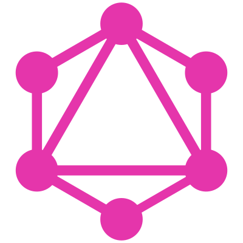

## Here is me

24 y.o., he/him (obviously)

I do a little ~~trolling~~ web development since 2016.

### I know and use

	
	
	
	
	

### I'm actively learning

### I had some experience with

	
	

--- 

